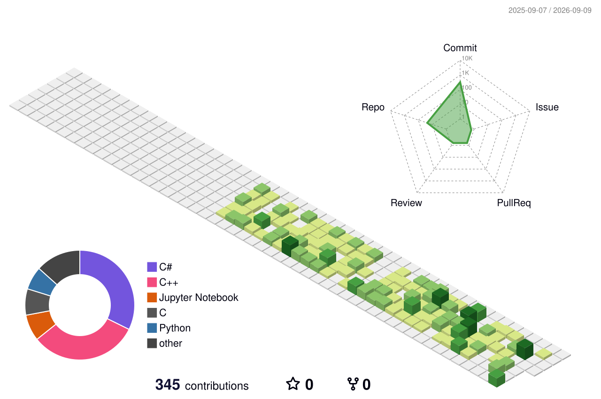

  

# 프로필

- 이름 : 천현빈(Cheon Hyeon-bin)
- 이메일 : gusqls7748@naver.com
- 전문분야 : C/C++, C# , Java,  Smart Factory, IoT, Python

## 기술스택

### 사용언어

    
    
    
    

    
    
    
    
    

### 데이터베이스

    
    
    

    
    
    

## OS

    
    
    
    

    
    
    
    

### DevOps

    
    
    
    

    
    
    
    

### 개발도구

    
    
    

    
    
    

### 기술명세

| 기술분류 | 보유기술 |
|---|---|
| Language | **[C]** - 구조적 프로그래밍 **[C++]** - 객체지향 프로그래밍 - STL 프로그래밍 **[C#]** - 객체지향 프로그래밍 - .NET 프로그래밍 **[Python]** - 데이터 처리 및 자동화 **[SQL]** - 데이터 조회 및 관리 |
| Framework | **[.NET 10]** - WPF 프로그래밍 - ASP.NET Core 기반 API 개발 **[ROS2]** - Pub/Sub 통신 프로그래밍 |
| Database | **[MySQL]** - 데이터베이스 설계 및 SQL 작성 **[PostgreSQL]** - 데이터 저장 및 관리 **[Redis]** - 캐시 및 실시간 데이터 처리 |
| OS | **[Windows]** **[Linux]** - Ubuntu - Raspbian |
| DevOps | **[Docker]** - 컨테이너 환경 구축 **[Kubernetes]** - 컨테이너 오케스트레이션 **[GitHub Actions]** - CI/CD 자동화 |
| Tools | **[Git]** - 형상 관리 **[Visual Studio]** - .NET 개발 환경 **[VS Code]** - 코드 편집 및 디버깅 **[VMware]** - 가상 환경 구성 |

### 프로젝트 리스트

- [WPF] 
    - [OpenAPI CCTV 모니터링앱](https://github.com/gusqls7748/iot-dotnet-2026/blob/main/TOYPROJECT.md)
- [.NET] 
    - [Orleans 기반 게임 서버 구현](https://github.com/gusqls7748/TricalRevive-Server/blob/main/README.md)
- [C++]
    - [비트코인 자동 매매 시스템](https://github.com/gusqls7748/iot-AutoTradingProject/blob/main/README.md)

### Contribution

## 🌱 My Contribution 3D Graph

